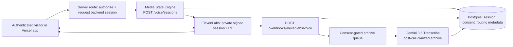

# Job Command — Live Voice Backend

## Purpose

Job Command is a **private, multilingual live voice experience** for the operator’s approved spokesperson/avatar. It uses the operator-owned ElevenLabs voice and approved avatar identity, with a straightforward, composed, welcoming delivery style.

It does **not** clone, emulate, route toward, or represent a public figure. Public figures are not an identity source, voice source, script source, cadence source, or content-template source. The campaign profile is original:

> **Direct, calm, decisive, welcoming, and plainspoken.** Clear value, concrete next steps, no theatrical wealth signaling, coercive persuasion, or personality mimicry.

## Correct realtime architecture



### Why this split

- **ElevenLabs Conversational AI** is the live conversation engine. The browser connects directly with a short-lived signed URL or the provider’s SDK/WebRTC transport. Vercel should remain the control plane—authenticate the user, issue session credentials, and ingest webhooks—rather than proxy continuous media.
- **Gemini 3.5 Transcribe** is the archive/QA lane. It handles an opted-in post-call audio file with speaker diarization and automatic language recognition. It is not a duplicate live audio loop, which would add latency, cost, privacy exposure, and turn-boundary drift.
- **Vercel** issues no provider key to the browser. The future Vercel route authenticates the site’s user, derives an opaque `visitor_ref` server-side, calls this backend, and returns the signed URL only to that user.

> ElevenLabs Agents’ documented multilingual flow uses its Agent configuration and language-specific voice presets; do **not** assume `eleven-v3` is the real-time agent model. Configure the private ElevenLabs Agent with the supported languages and its language-detection system tool. Use the operator’s authorized voice profile or a licensed language-specific fallback—not a public figure’s voice.

## Identity, consent, and language policy

| Control | Required behavior |
| --- | --- |
| Voice/Avatar identity | `JOB_COMMAND_OPERATOR_AUTHORIZED=true` is required before a session is issued. The configured owner references must describe the operator-approved voice/avatar. |
| Language | The router validates BCP-47 codes against `JOB_COMMAND_SUPPORTED_LANGUAGES`. An unsupported language is rejected before any paid provider call. |
| Accent | Accent is supported through a language-specific voice preset in the configured ElevenLabs Agent—not by identifying the caller’s identity from audio. |
| Live switching | Enable ElevenLabs’ supported language-detection tool. For a conservative experience, constrain switching to the first two caller turns and always offer explicit language selection. |
| Recording | Raw audio is stored and sent to Gemini only after `archive_consent: true`. Text transcript webhooks can still be accepted as provider data, subject to the product’s retention policy. |
| Session credential | The signed URL is an ephemeral bearer credential. It is returned once, never persisted in this application, never logged, never sent to analytics, and must be freshly issued for each call. |

## Backend endpoints

All Job Command routes (including the webhook) return **404 unless `JOB_COMMAND_VOICE_ENABLED=true`**. All endpoints except the provider webhook require the dedicated **`JOB_COMMAND_API_KEY`** (constant-time compared; the Media State Engine key is refused, and the two keys must differ). In production, the Vercel route calls these endpoints server-to-server; the browser should **not** hold this API key.

`POST /voice/sessions` is bounded before any ElevenLabs call (PR21-F4): a durable reservation in `voice_mint_attempts` enforces per-API-key, per-client-IP and per-`visitor_ref` short-window limits plus a global UTC-day cap (`JOB_COMMAND_VOICE_*` env vars; defaults 10/10/3 per 60 s and 50/day). Over-limit returns **429** (with `Retry-After` for window limits). Failed provider calls still consume budget. Any limit ≤ 0 disables minting.

> **Isolation status:** voice still shares the MSE API process, Postgres database and worker. Separate key, flag, and provider credentials limit blast radius today; a dedicated deployment/DB/worker is a follow-up.

| Endpoint | Purpose |
| --- | --- |
| `POST /voice/sessions` | Creates a database session and returns a short-lived ElevenLabs signed URL plus minimal safe conversation initialization data. |
| `POST /voice/sessions/{session_id}/provider-conversation` | Binds the conversation ID received after client start so post-call webhooks can be matched. |
| `GET /voice/sessions/{session_id}` | Shows session state and audit metadata; no signed URL is ever returned. |
| `POST /webhooks/elevenlabs/voice` | Receives raw signed post-call events. It verifies the `ElevenLabs-Signature` with the official SDK before storing anything. |

### `POST /voice/sessions` request

```json
{
  "visitor_ref": "app-user_opaque_123",
  "language": "es",
  "surface": "web",
  "archive_consent": true
}
```

### Response fields that the Vercel app may use

```json
{
  "session": { "id": "…", "resolved_language": "es", "state": "issued" },
  "connection": {
    "signed_url": "wss://…",
    "expires_at": "2026-…",
    "conversation_init": {
      "dynamic_variables": { "job_command_session_id": "…" },
      "conversation_config_override": { "agent": { "language": "es" } }
    }
  },
  "campaign": { "profile": "job-command", "language": "es" }
}
```

The Vercel frontend sends `conversation_init` to the ElevenLabs browser SDK on session start. In the ElevenLabs Agent dashboard/API, enable only the **Language** and **ASR keywords** overrides needed for this request; do not enable caller-controlled Voice ID or arbitrary prompt overrides.

## Vercel route contract

A future Vercel/Next.js route must enforce the application’s own user authentication and derive the opaque visitor reference from that authenticated session. Do not forward arbitrary client-supplied user IDs, voice IDs, agent IDs, or language lists.

```ts
// app/api/job-command/voice-session/route.ts — control plane only
export async function POST(req: Request) {
  const user = await requireSignedInUser(req);
  const { language, archiveConsent } = await req.json();

  const response = await fetch(`${process.env.MEDIA_ENGINE_URL}/voice/sessions`, {
    method: "POST",
    headers: {
      "content-type": "application/json",
      "x-api-key": process.env.JOB_COMMAND_API_KEY!, // NOT the MSE key
    },
    body: JSON.stringify({
      visitor_ref: `user:${user.id}`, // server-derived, opaque to the provider
      language,
      surface: "web",
      archive_consent: archiveConsent === true,
    }),
  });
  return Response.json(await response.json(), { status: response.status });
}
```

Use the official ElevenLabs browser client SDK (WebRTC is its normal browser transport) or its documented signed WebSocket connection. Do not relay microphone chunks through Vercel unless a later architecture explicitly requires it and includes reconnection/state design.

## Durable data schema

| Table | Data retained | Purpose |
| --- | --- | --- |
| `voice_agent_profiles` | Provider agent ID, operator ownership references, supported languages, policy | Locks Job Command routing to the approved profile. |
| `voice_sessions` | Opaque visitor ref, chosen language, consent, provider conversation ID, lifecycle state | Durable control-plane record. **No signed URL or API key.** |
| `voice_session_events` | Verified provider event with audio/binary fields **redacted** (size + sha256 only); unmatched callbacks keep a metadata-only envelope; consented audio is referenced via `audio_ref` | Deduplicates post-call callback retries. Raw audio never enters Postgres. |
| `voice_mint_attempts` | Fingerprints (sha256) of caller key and client IP, visitor ref, outcome | Durable signed-URL mint rate limits and daily cap. |
| `voice_transcript_turns` | Final provider turns and optional Gemini archive text | Conversation record with source attribution. |
| `voice_transcription_runs` | Gemini model/mode/status and consented source path | Auditable post-call archive workflow. |
| `voice_work_queue` | Retryable Gemini archive work | Keeps heavy transcription outside the webhook response. |

## Gemini archive rules

When a caller opted into archive processing and ElevenLabs sends a `post_call_audio` event, the engine decodes the MP3 to the archive storage path, records only an `audio_ref` in Postgres, and queues a Gemini file-transcription job. Without consent (or for an unmatched session) the audio is discarded: nothing is written to disk and the event row keeps only a redaction marker. Crashed archive claims are reclaimed after `VOICE_WORK_QUEUE_STALE_SECONDS`.

- Default archive mode is **`diarized`**: Gemini 3.5 Transcribe, verbatim transcription, auto language detection, speaker diarization.
- Gemini diarization is for recorded audio; **do not promise diarization from the Live API**.
- Gemini’s non-streaming file route supports audio up to one hour, but the diarization/word-timestamp use case has a shorter documented limit. Keep each archive below the provider’s current limit and verify it before a production release.
- Custom vocabulary is deliberately not sent in the diarized archive path because Gemini documents that it is incompatible with diarization/timestamps. Use a separate, explicit smart/vocabulary pass if a future product requirement needs it.

## Environment checklist

Set these values only in the deployment secret store—never in a browser bundle, committed `.env`, screenshots, or chat:

```bash
JOB_COMMAND_VOICE_ENABLED=true          # default false
JOB_COMMAND_API_KEY=...                 # distinct from MEDIA_ENGINE_API_KEY
ELEVENLABS_AGENTS_API_KEY=...           # no fallback to ELEVENLABS_API_KEY
ELEVENLABS_AGENT_ID=...
ELEVENLABS_AGENTS_WEBHOOK_SECRET=...
GEMINI_TRANSCRIBE_API_KEY=...
JOB_COMMAND_OPERATOR_AUTHORIZED=true
JOB_COMMAND_OWNER_VOICE_REF=operator-approved-voice-v1
JOB_COMMAND_OWNER_AVATAR_REF=operator-approved-avatar-v1
JOB_COMMAND_SUPPORTED_LANGUAGES=en,es,pt-BR
```

Keep `JOB_COMMAND_API_KEY`, `ELEVENLABS_AGENTS_API_KEY`, `ELEVENLABS_AGENTS_WEBHOOK_SECRET`, and `GEMINI_TRANSCRIBE_API_KEY` server-only. None of them falls back to an MSE credential (`GEMINI_API_KEY`, `ELEVENLABS_API_KEY`, `ELEVENLABS_WEBHOOK_SECRET`). Configure the ElevenLabs Agent dashboard with the same languages, verified operator voice, appropriate language presets, and the language-detection tool. Configure the post-call webhook to call `POST /webhooks/elevenlabs/voice` with HMAC signing enabled.

## Production readiness gates

1. **Identity gate:** record operator ownership/authorization for the configured voice and avatar. Do not reference a public figure’s identity, voice, scripts, or signature delivery.
2. **Provider gate:** create and test a private ElevenLabs Agent; allow only narrowly needed overrides.
3. **Language gate:** use a curated language list, native-speaker review of each welcome message, and a caller language fallback.
4. **Vercel gate:** authenticate the web user before issuing a session; rate-limit the route; keep signed URLs out of telemetry; use durable database state.
5. **Webhook gate:** verify raw HMAC-signed bytes, deduplicate provider events, return quickly, and queue expensive work.
6. **Archive gate:** show opt-in recording consent, use a retention/deletion policy, and protect transcript/audio access.
7. **Evaluation gate:** test latency, interruptions, ASR in target accents, language switching, language-specific voice quality, prompt safety, failed calls, webhook retries, and consent-off behavior before launch.

## Official sources

- [ElevenLabs WebSocket / signed URL authentication](https://elevenlabs.io/docs/eleven-agents/libraries/web-sockets)
- [ElevenLabs Agent language configuration](https://elevenlabs.io/docs/eleven-agents/customization/voice/customization/language)
- [ElevenLabs language detection system tool](https://elevenlabs.io/docs/eleven-agents/customization/tools/system-tools/language-detection)
- [ElevenLabs post-call webhooks](https://elevenlabs.io/docs/eleven-agents/workflows/post-call-webhooks)
- [Gemini 3.5 Transcribe](https://ai.google.dev/gemini-api/docs/transcribe)
- [Gemini 3.5 Transcribe developer guide](https://aistudio.google.com/learn/gemini-3-5-transcribe-developer-guide)
- [Vercel WebSocket guidance](https://vercel.com/guides/do-vercel-serverless-functions-support-websocket-connections)
